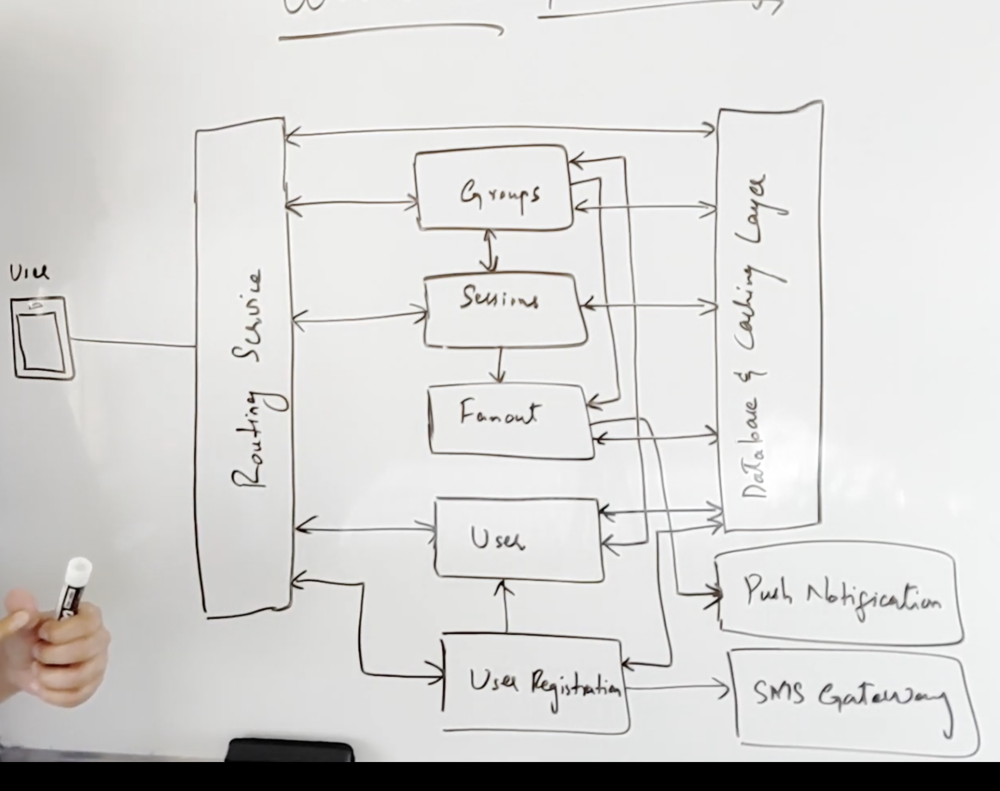
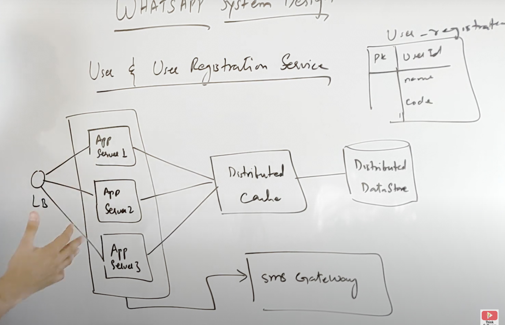
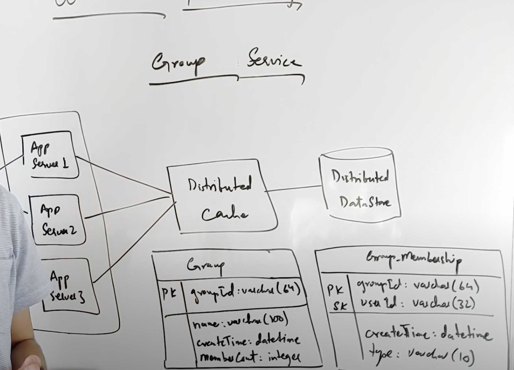
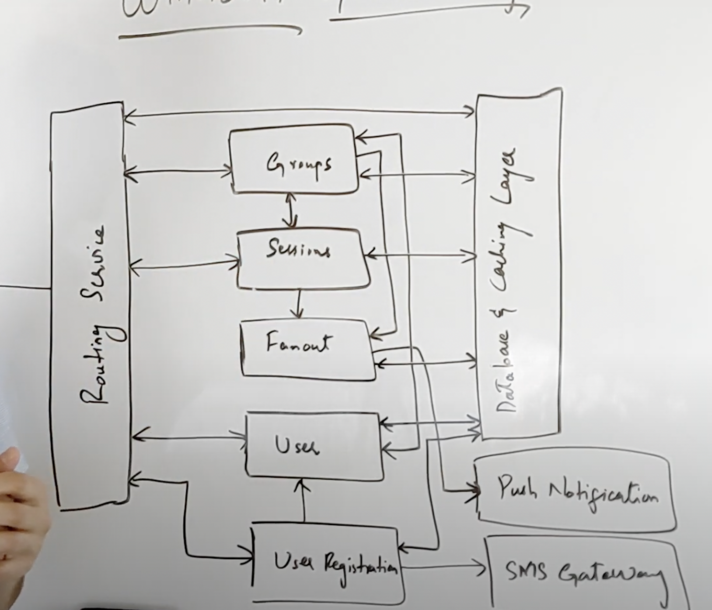

# WHATSAPP SYSTEM DESIGN

## functional requirements:
1. Receive or send message
2. group chat
3. track message status
4. use phone number as used id
5. Push notification
6. Receive message when online
7. analytics and monitoring
8. end to end encryption 
9. media files support
10. whatsapp web support

## non-functional requirment
1. Highly available
2. Scalable
3. Minimal latency
4. Consistency
5. Durability 

## Api Space
### Registration 
1. register Account(API key, user information)
2. validated account(api key, userID)
### chat
3. initiate direct chat session(api key, userId1,userID2)
4. SendMessage(API key,session id,message type,message);
5. get message status(api key,messageId)
6. read new Message(api key, session id, message id of last sent message)
### group chat
7. initiate group chat session(API key, group info)
8. add user to group(api key, user id, group id)
9. remove user(api key, user id,group id)
10. promote user to admin( api key, group info, user info)

(from uber system design)
# routing system
# web socket

# User registration 

# design of group service 

# chat session service

1. dedicated/ private chat session
2. group chat session

